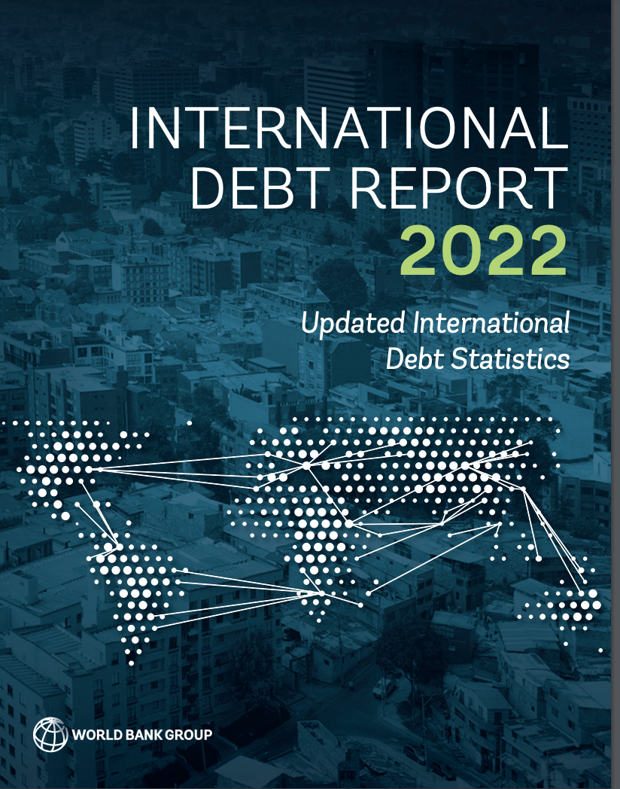

# World Bank International Debt Statistics Data from the December 2022 Data Release

***This Github Repo provides a tidyverse-friendly script for pulling and processing World Bank International Debt Statistics data with all available creditor counterparties.***

The data pulled and processed here was released along with the [World Bank 2022 International Debt Report](https://www.worldbank.org/en/programs/debt-statistics/idr/products) on December 6, 2022, and has data through 2021. 

Thank you to [David Mihalyi](https://www.davidmihalyi.com/) and Bálint Parragi who provided me with example code. I've pulled the same series that they have, but if you want to pull other series, my R script is well-annotated and shows you all of the other available series and how to modify to script to pull those series.

**What is in the Repo?**

- an R Notebook in the folder `00_script` that has nnotated instructions for pulling & cleaning the data.
- In the folder `01_data_processed` you'll find the processed IDS data in .csv format, along with .csv files showing all unique values for key variables (debtors, creditors, available series). 

